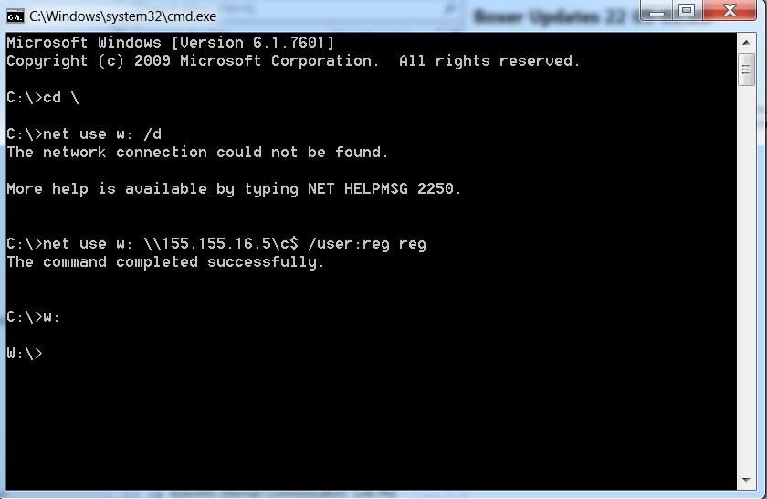
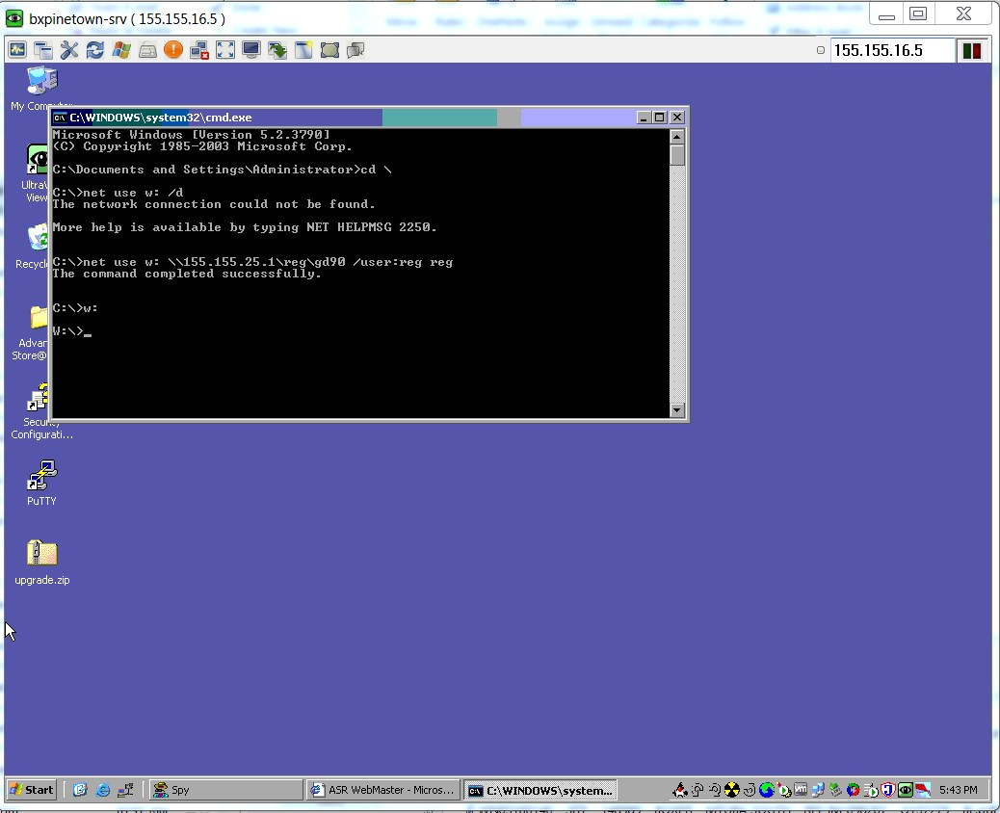

How to net use to a Server\Till
To Connect to Server:
1.	Type cd \ (This is to navigate to the root directory of machine)
2.	Net use w: /d (to delete existing drives, should there already be a w drive)
3.	Net use w: \\155.155.16.5\c$ /user:reg reg (to net use to the c drive of the server)
4.	Now navigate to w:

| Command         | Description | #
|--------------|:-----:|-----------:|
| Net use w:   |  Map a drive of a computer on your network and giving it a drive letter which is W: (this could be any letter of the alphabet except a: c: d: e:(which is the FLOPY-DRIVE, HARD-DRIVE, CD-ROM and Backup Drive)
| \\155.155.16.5\c$    |  This is the IP of the machine and drive you want to map |
| /user:reg reg |  User indicates the username and password which is reg reg

*The screenshot below shows the whole process:*

------------------------------------------------------------

To Connect to Till:

1.	Type cd \ (This is to navigate to the root directory of machine)
2.	Net use w: /d (to delete existing drives, should there already be a w drive)
3.	Net use w: \\155.155.25.1\reg\gd90 /user:reg reg (to net use to the root directory of the till of the server)
4.	Now navigate to w:

**Please note that the process of the till will need to be performed from the server as we are unable to access the tills from our network**

| Command         | Description | #
|--------------|:-----:|-----------:|
|Net use w:    |Map a drive of a computer on your network and giving it a drive letter which is W: (this could be any letter of the alphabet except a: c: d: (which is the FLOPY-DRIVE, HARD-DRIVE and CD-ROM)
|\\155.155.16.5\reg\gd90 | This is the IP of the machine and directory you want to map
| /user:reg reg | User indicates the username and password which is reg reg

*The screenshot below shows the whole process:*

