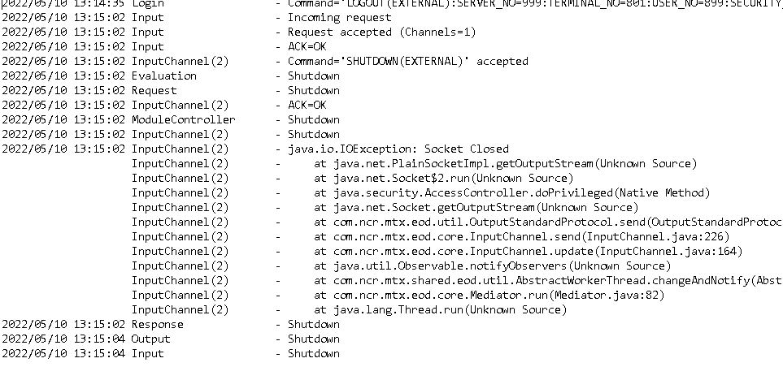

## SERVER LOAD

**After install check below in internet explorer**

> Enable Active X

> All Internet Settings

**Disk Folders to copy to E: Drive**

- [x] BSS
- [x] BASIC
- [x] SAUPGRD

> **Check For Ver 2003 .txt file on all Disks**

> RPV30 version 15 - latest version

> Check Date and Time on server

KEY GENRATOR FOR LOAD

- key generator access

**EDITING FILES**

> Return Character and End of Editing Files

> Control A to Check Line Spacing

> Follow Document

opc install - change directory to web  folder

web master

MANAGER - password - mngr

xncr

*CORE STATUS LOG FILE TEST*

