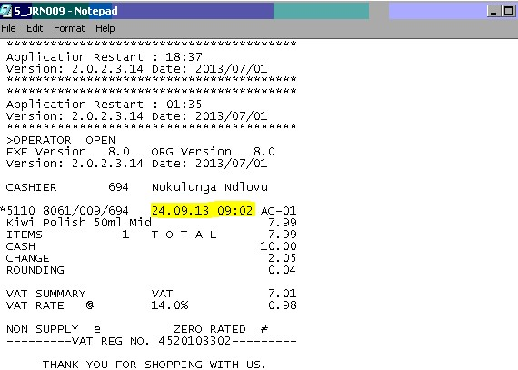
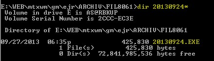

Locating IDC’s that are older than 30 days (EJR)

This doc is how to recreate an IDC that is older than 30 days. Below is an example of this.

Example:
Bug Number: 2891
The bug lists a defective till number 9 that needs to be brought back online. While investigating I found that the data on the till was for the 24/09/2013 and the current date is the 20/11/2013

*JRN Example*

To confirm if the tills data had processed I would need to go back to old transactions. Do this you will need to make use of the historical data on the servers EJR.

This data can be found on the E:\ drive in the following directory.
- E:\WEB\mtxwm\gm\ejr\ARCHIV\FIL8061

 - Search for the date that is missing. C:\dir 20130924*

You should get the below screen…

*Historical DATA Example*

All you need to do now is run the exe in dos and it will create an IDC with the same date.
You can then notepad this file and check the contents to see if it is what you require.
