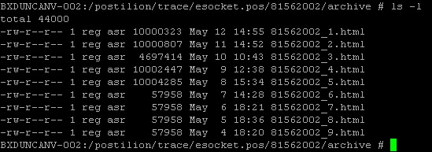

Locating the Trace files for an EFT Device connected to a till.

-	Putty into the till where the transaction took place.
-	User username: root and password: root
- Navigate to the esocket.pos directory (cd /postilion/    trace/esocket.pos)

- List the files and folders available (ls –l)
	Change to the directory closest to the date of the transaction (EG. cd 81562002)

-  Change to the archive directory (cd archive)
 List the files in this folder (ls –l)
 You should see something similar to the below…

*Postilion Trace files*

- Copy these files from Linux to the server. Type the following while in the archive folder:
-	md /home/reg/esoc
-	cp *.html /home/reg/esoc
-	Then go to DOS and type the following :
-	Net use t: \\IP Address of till\reg\esoc /user:reg reg

	You can now connect to the t: drive and collect your files.
