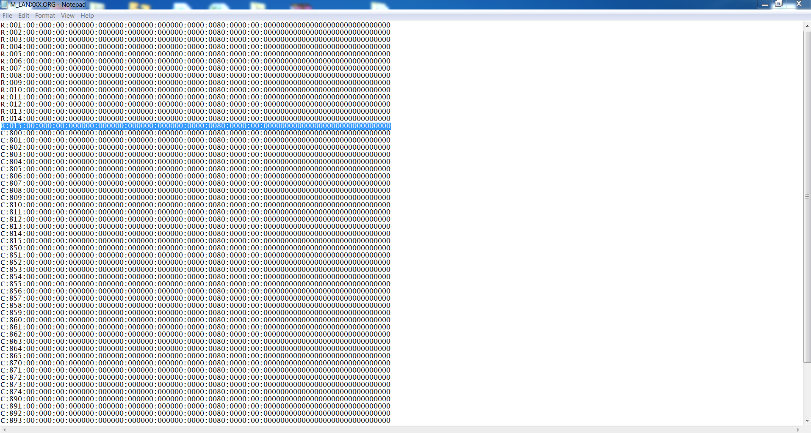
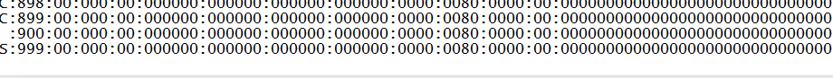

Cd \\server\\lanAdding additional lanes to server:

Open cmd:

Type md \\nds\\parorg

Then navigate to server directory:

C:\\server

Now backup all necessary files to created folder/directory in nds:

Copy M_LANXXX.ORG c:\\nds\\parorg

Copy M_BILXXX.ORG c:\\nds\\parorg

Copy M_CNTXXX.ORG c:\\nds\\parorg

Copy S_SPFXXX.ORG c:\\nds\\parorg

After backups, notepad files and add tills : select whole line and copy it down depending on how many tills/lanes needs to be added, change to correct till numbers , below and make sure that there is a carriage return at the end of the file, shown below in B)

A)

B) There should be a carriage return, at the end of files:

When done with all the .ORG files copy all files to the following directories (what this idiot meant is, look if there is any offline tills and rebuild pos server to let the tills show up on SPY. ORRRRRRR Leave it till after EOD. KR GUSSI. )

C: \\server\\lan

C:\\web\\mtxwm\\gm\\lan

After copying files import data into database:

Cd \\bosupd

Dbimpmig.bat
