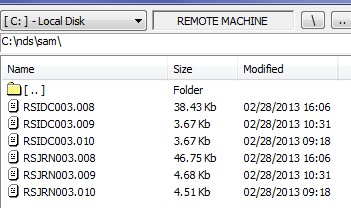

## How to check for missing data ##

1.	Run get_data.cmd in the c:\nds directory.
2.	The script will then place all the data in the c:\nds\bytes directory
3.	Navigate to bytes\data\safe\safeinit and dir * till no.* /od and see if you can find the data in there.

IF THE DATA IS NOT IN THE ABOVE MENTIONED DIRECORIES   PLEASE FOLLOW THE NEXT STEP:
1.	Navigate to server\safe
2.	Dir RS* till no.* /od and check for data “RSIDC” & “RSJRN” for the missing dates.

The below was found in the server\safe

*RSIDC & RSJRN EXAMPLE DATA*

