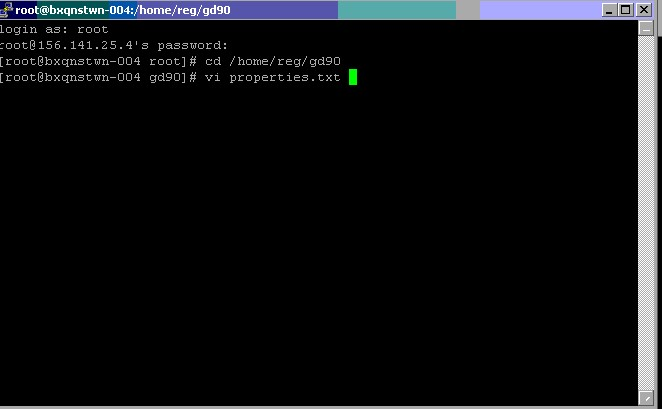
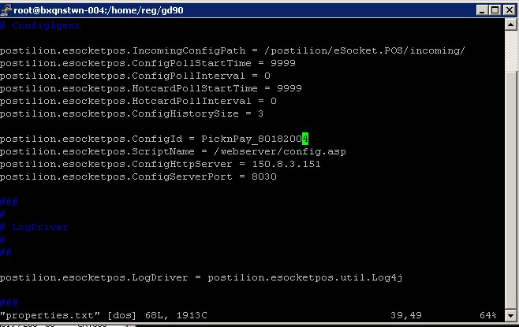

**How to update POST.TAR.GZ**

1.	From the server cmd type cd \server\mtx7\esocket
2.	View the date and size of the post.tar.gz(Confirm with colleagues what the latest file should be)
3.	Connect to share drive Boxer/Support-Material/POST.TAR (IP :10.21.0.222 Boxer/Support-Material/POST.TAR username and password = boxer password1 ) and copy it to store (cd \server\mtx7\esocket)
4.	Get boxer to run an eSocket agent from till and test

**eSocket agent from POS**

5.	5 Installations
6.	9 Pos Utils
7.	Password 12345
8.	8 eSocket Agent
9.	Bring till up:
10.	0 exit
11.	1 Pos Program
12.	8 Other
13.	Password: 12345
14.	Close vnc window and type the following in putty
15.	Cd /home/reg/gd90
16.	Vi properties.txt
17.	Navigate to the section where it shows the till ID and config server IP using your arrow keys.

**Please see screenshots below:**

