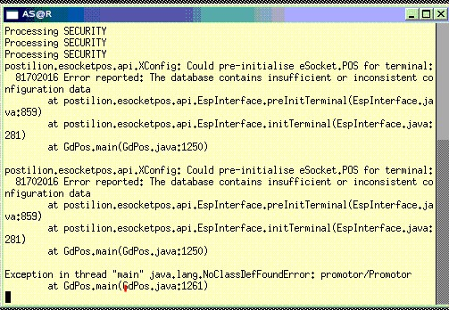

title:: Java.lang.NoClassDefFoundError

- title:: Java.lang.NoClassDefFoundError
- 
- **Net Use to the affected till mount the drive.**
-
-
- Once you on the till Replace lib folder on the till , from a working till
- Run software update
- If that doesn’t work then : 
              Rename 7052_UPD to 7052_MST and visa versa 
             In c:\server\mtx7\pos\java\linux\upd
- Run software update